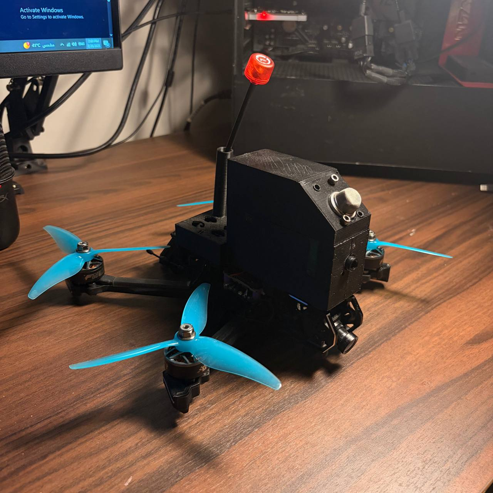
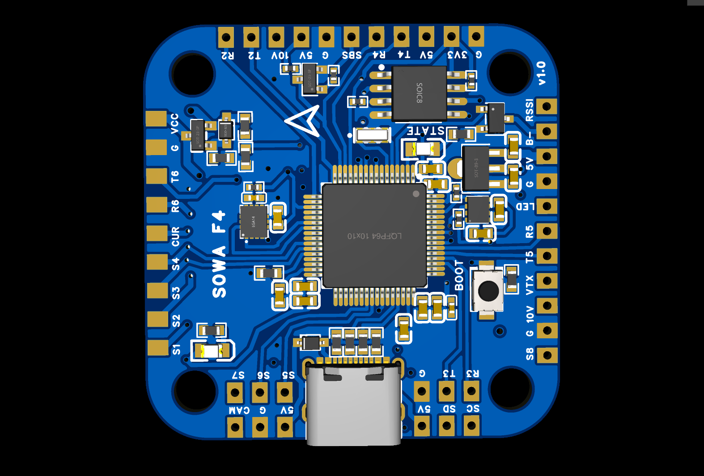
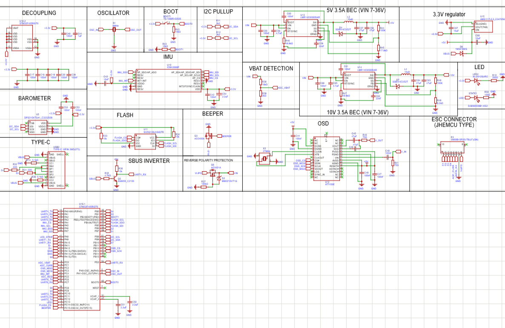
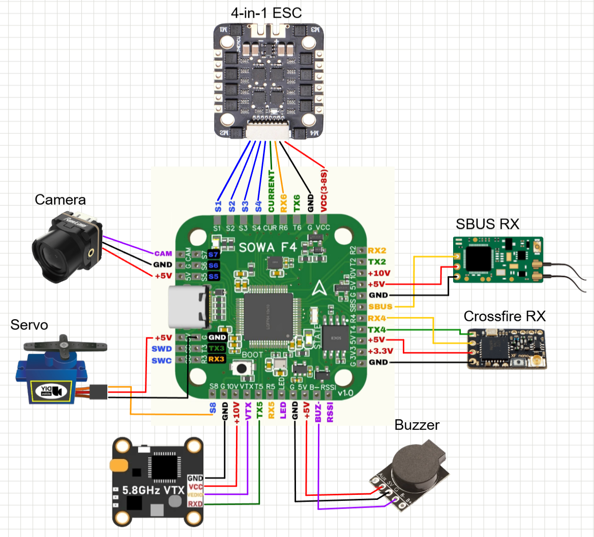
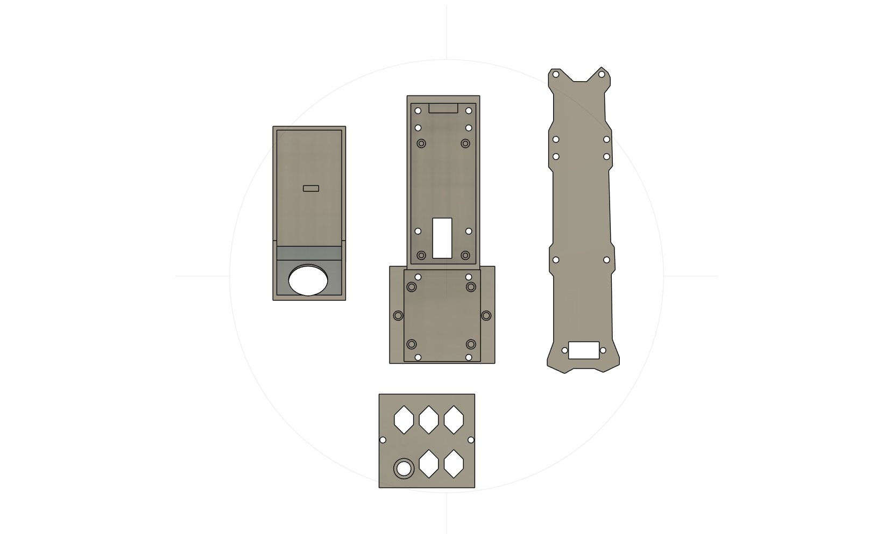
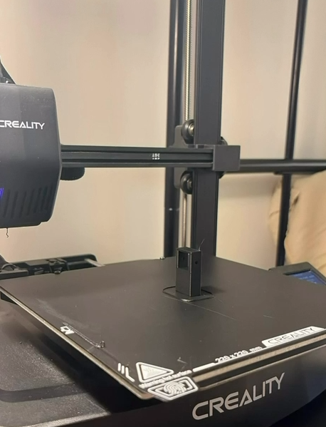
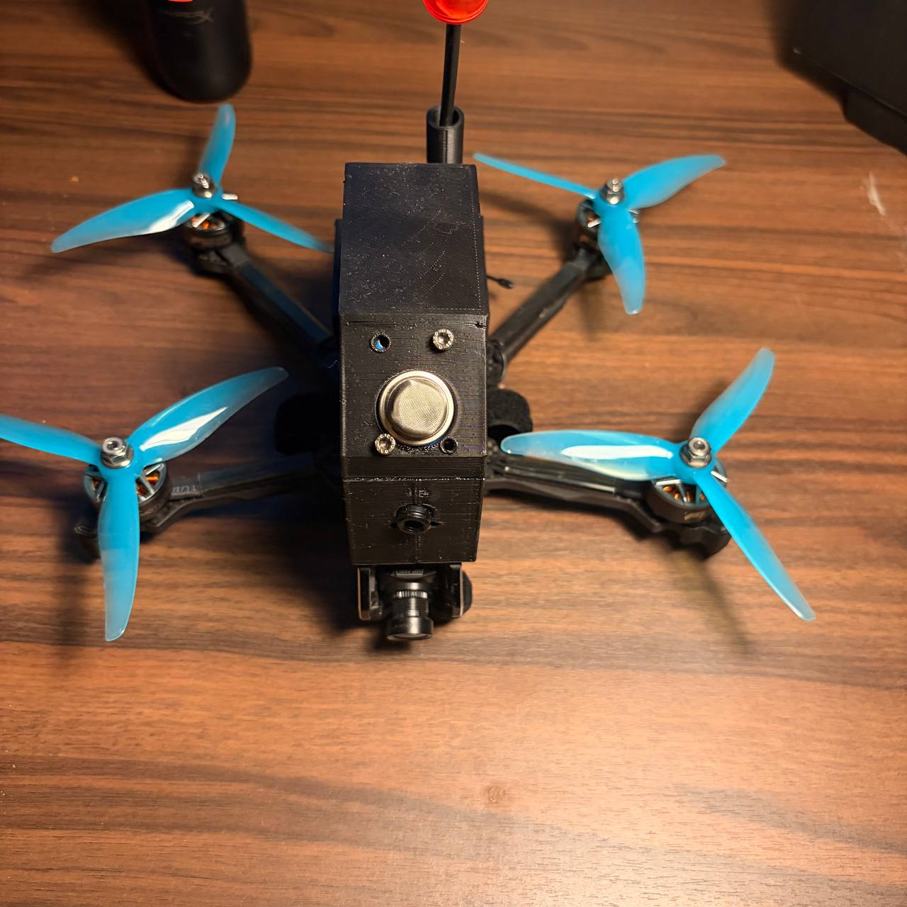

# درون فحص الحقول النفطية

درون FPV رباعية المراوح مبنية حول **متحكم طيران صممته من الصفر** — لوحة SOWA F4 — تحمل مستشعر غاز ومستشعر حرارة لفحص منشآت الحقول النفطية وكشف تسريبات الغاز أو الحرارة غير الطبيعية قبل أن تتحول إلى حادث.

كل شيء في هذا المشروع مصمم خصيصاً له عدا المواتير والـ ESC وأجهزة التحكم الجاهزة: لوحة متحكم الطيران، وجسم الطائرة المطبوع ثلاثي الأبعاد، وحوامل المستشعرات.



*[English](README.md)*

---

## الفكرة والدافع

فحص خطوط الأنابيب والفلنجات والصمامات وخزانات التخزين في حقل نفطي يعني عادةً إرسال شخص إلى منطقة حارة ونائية وقد تكون خطرة. الدرون الصغيرة تستطيع تغطية المسار نفسه في دقائق، وبثّ فيديو مباشر للطيّار، وقياس تركيز الغاز ودرجة حرارة السطح في الوقت نفسه — دون أن يقف أحد بجانب تسريب محتمل.

## متحكم الطيران — SOWA F4 v1.0

جوهر المشروع. لوحة متحكم طيران بأربع طبقات ومقاس 30.5×30.5 مم، مصممة ببرنامج EasyEDA حول معالج STM32F405، ومتوافقة كلياً مع Betaflight.



| الوحدة | القطعة | الوظيفة |
|---|---|---|
| المعالج | STM32F405RGT6 | المعالج الرئيسي، 168 ميغاهرتز |
| وحدة القصور الذاتي | ICM-42688-P | جيروسكوب ومقياس تسارع، SPI |
| البارومتر | DPS310 | تثبيت الارتفاع |
| الصندوق الأسود | W25Q128 (16 ميغابايت) | تسجيل بيانات الطيران |
| الـ OSD | AT7456E + كريستال 27 ميغاهرتز | عرض البيانات على شاشة الفيديو |
| خط 5 فولت | LMR16030، 3.5 أمبير | الملحقات، الريسيفر، الكاميرا |
| خط 10 فولت | LMR16030، 3.5 أمبير | تغذية الـ VTX |
| خط 3.3 فولت | AMS1117-3.3 | الدوائر المنطقية |
| جهد الدخل | 7–36 فولت (2S–8S) | مع حماية من عكس القطبية |
| المنفذ | Type-C | الإعداد وتحميل البرنامج |
| منافذ UART | 6 منافذ | الريسيفر، VTX، GPS، التيليمتري |
| موصل الـ ESC | 8 أطراف بمعيار JHEMCU | ESC رباعي، S1–S4 مع استشعار التيار |

اللوحة تتضمن أيضاً عاكس SBUS بمكونات فعلية، ومقسّم جهد لمراقبة البطارية، ودائرة قيادة للصفارة، ومخرج لشريط LED قابل للعنونة.

**المخطط الكهربائي الكامل:**



ملفات التصميم وملفات Gerber وقائمة المكونات في [`hardware/pcb/`](hardware/pcb/).

## التوصيلات

طريقة ربط اللوحة ببقية أجزاء الطائرة:



## الهيكل

الجسم والغطاء وبرج المستشعر واللوحة السفلية صُممت ببرنامج Fusion 360 وطُبعت على طابعة Creality Ender 3 S1. التصميم يضع مستشعر الغاز أعلى الطائرة، فوق تيار هواء المراوح وبعيداً عنه، ليأخذ عينة من الهواء المحيط لا من الهواء الذي تدفعه المراوح للأسفل.

<!-- TODO: المادة وإعدادات الطباعة، مثال PETG، طبقة 0.2 مم، 4 جدران، تعبئة 30% -->

| التصميم | القطع مفصّلة |
|---|---|
|  |  |

أثناء الطباعة:



ملفات STL وملفات Fusion الأصلية في [`hardware/frame/`](hardware/frame/).

## المستشعرات



| المستشعر | القطعة | ما يقيسه |
|---|---|---|
| الغاز | سلسلة MQ <!-- TODO: الموديل الدقيق، مثال MQ-2 / MQ-5 --> | الغازات القابلة للاشتعال وأبخرة الهيدروكربونات، خرج تحليلي |
| الحرارة | <!-- TODO: الموديل --> | <!-- TODO: بالتلامس أم بالأشعة تحت الحمراء؟ --> |

<!-- TODO: كيف تصل القراءات للطيّار — على شاشة الـ OSD، أم تيليمتري، أم تُسجَّل داخلياً؟ -->

## بقية المكونات

| النظام | القطعة |
|---|---|
| المواتير | <!-- TODO: مثال 2207 1750KV --> |
| الـ ESC | رباعي في واحد، <!-- TODO: التيار --> |
| المراوح | 5 إنش ثلاثية الشفرات |
| كاميرا FPV | <!-- TODO: الموديل --> |
| الـ VTX | 5.8 غيغاهرتز، <!-- TODO: القدرة --> |
| وصلة التحكم | <!-- TODO: ELRS / Crossfire --> |
| النظارة | <!-- TODO: الموديل --> |
| البطارية | <!-- TODO: مثال 4S 1500mAh LiPo --> |

## البرمجيات

التحكم في الطيران يعمل عبر **Betaflight**، والإعدادات كاملة محفوظة كملف CLI dump لإعادة نفس الضبط بدقة:

```bash
# في Betaflight Configurator ← تبويب CLI
diff all        # لعرض الإعدادات الحالية
# لاستعادة إعدادات هذا المشروع، الصق محتوى الملف:
# firmware/betaflight/cli_dump.txt
```

## هيكل المستودع

```
.
├── hardware/
│   ├── pcb/          # ملفات EasyEDA، المخطط، Gerbers، قائمة المكونات
│   └── frame/        # ملفات Fusion 360 وملفات STL
├── firmware/
│   └── betaflight/   # ملف الإعدادات وملاحظات الضبط
├── docs/
│   └── assembly.md   # ملاحظات التجميع
├── media/
│   └── images/
└── README.md
```

## السلامة

- بطاريات الليثيوم: اشحنها في كيس مقاوم للحريق، لا تتركها بدون مراقبة، ولا تطيّر بطارية منتفخة.
- افصل المراوح دائماً عند توصيل البطارية على طاولة العمل.
- **هذه الطائرة غير معتمدة للأجواء الخطرة أو القابلة للانفجار.** مستشعرات الغاز ذات العنصر الحراري والمواتير وبطاريات الليثيوم كلها مصادر إشعال. تعامل معها كنموذج أولي ومنصة بحثية — أي استخدام فعلي قرب تسريب هيدروكربوني حقيقي يتطلب أجهزة معتمدة (ATEX / IECEx).
- التزم بأنظمة الطيران المحلية — في السعودية: تسجيل الطائرة لدى الهيئة العامة للطيران المدني (GACA) وقواعد المجال الجوي — واحصل على تصريح الموقع قبل الطيران فوق أي منشأة.

## خطة التطوير

- [ ] عرض قراءات الغاز والحرارة على شاشة الـ FPV عبر الـ OSD المدمج في اللوحة
- [ ] تسجيل البيانات على الذاكرة الداخلية مع الوقت والتاريخ
- [ ] إضافة GPS ومسارات مبرمجة لتكرار جولات الفحص
- [ ] معايرة المستشعرات مقابل تركيز غاز مرجعي
- [ ] إصدار v1.1 من اللوحة <!-- TODO: هل ظهرت أخطاء بعد تجميع v1.0؟ -->

## الترخيص

<!-- TODO: MIT للبرمجيات، و CERN-OHL-S للعتاد — دمج شائع -->

## المؤلف

نواف الغامدي <!-- TODO: لينكدإن / وسيلة تواصل -->
