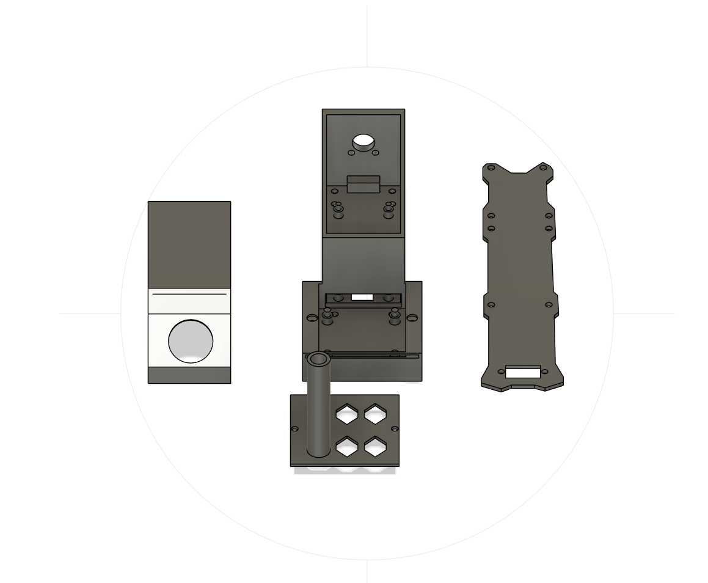

# درون فحص FPV — كشف تسريب الغاز والحرارة في الحقول النفطية

درون رباعية المراوح مبنية بالكامل يدوياً، تحمل مستشعر غاز ومستشعر حرارة، ومصممة لفحص منشآت الحقول النفطية وكشف تسريبات الغاز أو الحرارة غير الطبيعية قبل أن تتحول إلى حادث. الهيكل مطبوع ثلاثي الأبعاد، ولوحة المستشعرات لوحة PCB مصممة خصيصاً لهذا المشروع.

<!-- TODO: ضع أفضل صورة للدرون هنا -->


*[English](README.md)*

---

## الفكرة والدافع

فحص خطوط الأنابيب والفلنجات والصمامات وخزانات التخزين في حقل نفطي يعني عادةً إرسال شخص إلى منطقة حارة ونائية وقد تكون خطرة. الدرون الصغيرة تستطيع تغطية المسار نفسه في دقائق، وبثّ فيديو مباشر للطيّار، وقياس تركيز الغاز ودرجة حرارة السطح في الوقت نفسه — دون أن يقف أحد بجانب تسريب محتمل.

## المميزات

- بث فيديو FPV مباشر إلى نظارة يلبسها الطيّار للفحص القريب اليدوي
- استشعار الغازات القابلة للاشتعال وأبخرة الهيدروكربونات
- استشعار الحرارة لرصد المعدات التي ترتفع حرارتها بشكل غير طبيعي
- لوحة PCB مخصصة تحمل المستشعرات وتربطها بمنظومة الطيران
- هيكل وحوامل مستشعرات مطبوعة ثلاثية الأبعاد ومصممة حسب الإلكترونيات
- تحكم طيران مبني على Betaflight، مضبوط لطيران بطيء ومستقر مناسب للفحص

## المكونات

| النظام | القطعة | ملاحظات |
|---|---|---|
| متحكم الطيران | STM32 **F405** | يعمل بنظام Betaflight |
| متحكم المواتير | **ESC** رباعي في واحد | <!-- TODO: التيار، مثال 45A --> |
| المواتير | <!-- TODO: مثال 2306 1700KV --> | |
| المراوح | <!-- TODO: المقاس --> | |
| مرسل الفيديو | **VTX** | <!-- TODO: 5.8 غيغاهرتز، القدرة --> |
| كاميرا FPV | <!-- TODO: الموديل --> | |
| النظارة | <!-- TODO: الموديل --> | تُلبس على الرأس لقيادة الدرون |
| وصلة التحكم | ريسيفر + ترانسميتر | <!-- TODO: البروتوكول، مثال ELRS / CRSF --> |
| مستشعر الغاز | <!-- TODO: مثال MQ-2 / MQ-5 --> | خرج تحليلي |
| مستشعر الحرارة | <!-- TODO: مثال MLX90614 / DS18B20 --> | <!-- بالتلامس أم بالأشعة تحت الحمراء؟ --> |
| لوحة المستشعرات | PCB مخصصة (انظر `hardware/pcb/`) | مصممة ببرنامج <!-- TODO: KiCad / EasyEDA --> |
| الهيكل | طباعة ثلاثية الأبعاد (انظر `hardware/frame/`) | <!-- TODO: المادة، مثال PETG --> |
| البطارية | <!-- TODO: مثال 4S 1500mAh LiPo --> | |

### لوحة PCB المخصصة

<!-- TODO: فقرة أو فقرتان: وظيفة اللوحة، مصادر الجهد، كيف تصل قراءات المستشعر للطيّار -->


ملفات التصميم والمخطط الكهربائي وملفات Gerber في مجلد [`hardware/pcb/`](hardware/pcb/).

### الهيكل المطبوع

<!-- TODO: فكرة التصميم — طول الأذرع، الوزن، موضع المستشعرات بعيداً عن هواء المراوح، إعدادات الطباعة -->



ملفات STL وملفات التصميم الأصلية في [`hardware/frame/`](hardware/frame/).

## البرمجيات

التحكم في الطيران يعمل عبر **Betaflight**، والإعدادات كاملة محفوظة كملف CLI dump ليستطيع أي شخص إعادة نفس الضبط:

```bash
# في Betaflight Configurator ← تبويب CLI
diff all        # لعرض الإعدادات الحالية
# لاستعادة إعدادات هذا المشروع، الصق محتوى الملف:
# firmware/betaflight/cli_dump.txt
```

<!-- TODO: إذا كانت المستشعرات تعمل بمتحكم دقيق منفصل، اشرح الكود هنا وضعه في firmware/sensors/ -->

## هيكل المستودع

```
.
├── hardware/
│   ├── pcb/          # المخطط، التخطيط، Gerbers، قائمة المكونات
│   └── frame/        # ملفات CAD وملفات STL للطباعة
├── firmware/
│   ├── betaflight/   # ملف الإعدادات وملاحظات الضبط
│   └── sensors/      # كود لوحة المستشعرات
├── docs/
│   ├── wiring.md     # مخطط التوصيلات وتوزيع الأطراف
│   └── assembly.md   # خطوات التجميع
├── media/
│   ├── images/
│   └── videos/
└── README.md
```

## معرض الصور

<!-- TODO: أضف صورك هنا. للفيديوهات راجع الملاحظة أدناه -->

| | |
|---|---|
|  |  |
|  |  |

**فيديوهات الطيران:** <!-- TODO: رابط يوتيوب — جيت هاب يحدّ حجم الملف بـ 100 ميغابايت، فاستضف الفيديو خارجياً وضع الرابط -->

## السلامة

- بطاريات الليثيوم: اشحنها في كيس مقاوم للحريق، لا تتركها تشحن بدون مراقبة، ولا تطيّر بطارية منتفخة.
- افصل المراوح دائماً عند توصيل البطارية على طاولة العمل.
- **هذه الدرون غير معتمدة للأجواء القابلة للانفجار.** مستشعرات الغاز ذات العنصر الحراري والمواتير والبطاريات كلها مصادر إشعال. تعامل معها كنموذج أولي ومنصة بحثية — أي استخدام فعلي قرب تسريب هيدروكربوني حقيقي يتطلب أجهزة معتمدة (ATEX / IECEx).
- التزم بأنظمة الطيران المحلية (في السعودية: تسجيل الطائرة لدى الهيئة العامة للطيران المدني GACA وقواعد المجال الجوي) واحصل على تصريح الموقع قبل الطيران فوق أي منشأة.

## خطة التطوير

- [ ] عرض قراءات الغاز والحرارة مباشرة على شاشة الـ FPV (OSD)
- [ ] تسجيل البيانات على ذاكرة داخلية مع الوقت والتاريخ
- [ ] إضافة GPS ومسارات مبرمجة لتكرار جولات الفحص
- [ ] معايرة المستشعرات مقابل تركيز غاز مرجعي
- [ ] تغليف محكم ضد الغبار والحرارة

## الترخيص

<!-- TODO: اختر واحداً — MIT للكود، CERN-OHL-S للعتاد، CC-BY-SA للتوثيق -->

## المؤلف

<!-- TODO: اسمك، لينكدإن، وسيلة تواصل -->
